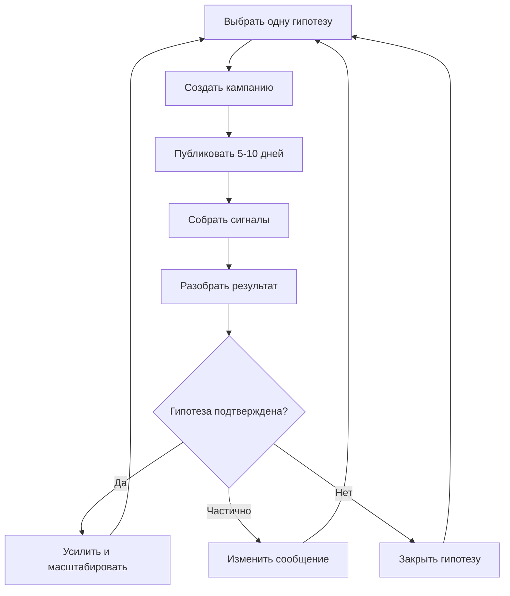

# Never Blank — Growth Strategy

Статус: действующая стратегия (заменяет предыдущий подход "продавать всё сразу").
Последнее обновление: 2026-07-21.

## Проблема, которую решаем

Раньше Never Blank пытался объяснять аудитории всю систему целиком — архитектуру,
автономность, интеграции. Клиенту это безразлично. Он покупает конкретное изменение
в своей жизни или бизнесе. Смешение четырёх разных вещей (Never Blank, Clarity Lab,
VGroup, экспертность Вали как основателя) в одном потоке контента размывает ответ на
вопрос читателя: "зачем мне за этим следить и что мне здесь предлагают?"

## Лестница продуктов

| Уровень | Что покупает человек |
|---|---|
| **Never Blank** | Постоянное присутствие бизнеса в контенте — без постоянного участия владельца |
| **VGroup** | Анализ и перестройка более широких бизнес-процессов, интеграций и AI |
| **Clarity Lab** | Продукты/опыт для мышления и ясности — и одновременно живая витрина того, как работает Never Blank |

Правило: **каждый канал/пост продаёт один уровень за раз.** Never Blank может
приводить клиента в VGroup, если в ходе работы обнаруживается более глубокая
проблема — но не продаёт оба с первого экрана.

## Позиционирование Never Blank

**Обещание (то, что говорим):**
> Ваш бизнес продолжает быть заметным, даже когда у вас нет времени постоянно
> придумывать, писать и публиковать контент.

**Чего НЕ говорим на первом экране:**
- "AI пишет посты" — это механика, не обещание
- "автономный research engine" — это архитектура, не польза
- "интеграции" — это реализация, не результат

Существующие `config/brand.yaml` и `config/brand_voice.md` уже во многом совпадают
с этим позиционированием ("visibility is not a personality trait — it is a system") —
эта стратегия не переписывает голос бренда, а даёт ему коммерческую дисциплину:
цикл гипотез, роли, критерии успеха.

## Clarity Lab как доказательство

Clarity Lab не втискивается в каждый пост как второй продукт. Через него показываем:
как система находит темы, строит контент, меняет стратегию, какие публикации
вызывают реакцию, чему научилась за неделю/месяц. Clarity Lab при этом продолжает
самостоятельно привлекать свою аудиторию — это отдельный контентный поток, не
подмешанный в Never Blank ради лидов.

## Цикл самообучения (эксперимент-driven growth)

Каждая стратегия хранится как эксперимент в [`strategy/hypothesis_log.md`](../../strategy/hypothesis_log.md):
кого хотим привлечь, какую проблему проверяем, какое обещание даём, какой контент
публикуем, какой CTA используем, сколько длится тест, что считаем успехом, какие
вопросы/возражения получили, были ли сигналы, продолжать/менять/останавливать.

**Лайки сами по себе почти ничего не доказывают.** Сигналы, которые считаем:
человек узнал себя в проблеме → задал вопрос → перешёл смотреть продукт →
попросил пример → согласился на разговор → оставил контакт → купил.

## Роли

Вместо одного "универсального маркетолога-продажника" — три отдельные роли с чёткими
границами. Полные системные промпты: `config/prompts/role_marketer.yaml`,
`config/prompts/role_salesperson.yaml`, `config/prompts/role_experiment_analyst.yaml`.
Статус `draft` — это операционные рамки для Claude при ручной/полу-ручной работе над
стратегией, пока не зашиты в автоматизированный вызов пайплайна (это отдельная
инженерная задача, не часть текущего изменения).

| Роль | Отвечает за | Не имеет права |
|---|---|---|
| **Маркетолог** | сегменты, проблемы/желания, позиционирование, контент-гипотезы, кампании, каналы, анализ реакции аудитории | придумывать факты о клиентах, называть стратегию успешной без данных |
| **Продажник** | превращение интереса в разговор, оффер, квалифицирующие вопросы, диагностика проблемы, возражения, follow-up, конкретный следующий шаг | продавать в лоб каждому подряд — сначала диагностика, есть ли реальная проблема |
| **Аналитик экспериментов** | сравнение гипотез, сбор результатов, отделение фактов от предположений, фиксация возражений, решение continue/modify/stop | делать выводы без данных, путать мнение с сигналом |

Роль "второго стратегического контура" (подвергать сомнению выводы, искать
противоречия) выполняет Валя вместе с Claude в диалоге — не отдельный промпт.

## Первый эксперимент

Полное описание — [`strategy/hypothesis_log.md`](../../strategy/hypothesis_log.md#эксперимент-1).
Кратко: аудитория — владельцы экспертных/сервисных бизнесов с нерегулярным
присутствием в соцсетях; обещание — постоянное присутствие без постоянной ручной
работы; 7 постов за 7-10 дней; CTA — диагностика текущей системы присутствия,
не прямая продажа.
